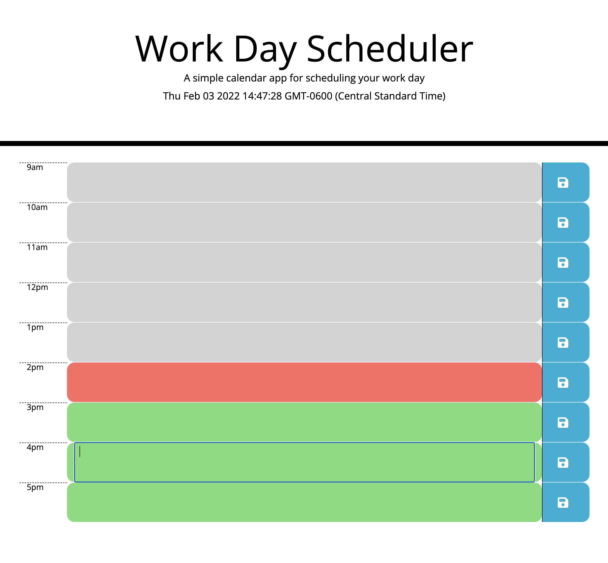

# Super Scheduler

Super Scheduler is a workday scheduler that allows users to add important events to a daily planner in order to manage time effectively. Time blocks are color-coded to indicate past (grey), present (red), and (future) according to the time displayed in the header.

## Using Super Scheduler

* Click on a time block to input an event.
* Hit the save icon on the right to save inputed text to that timeblock. This will save to local storage and will populate in time block when page is refreshed.

## Technologies

* HTML
* CSS
* Javascript

## Link

* https://bhenry30.github.io/super-scheduler/

## Contributers

* Brandon Henry